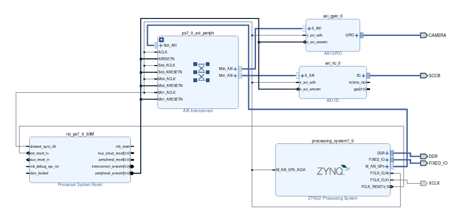
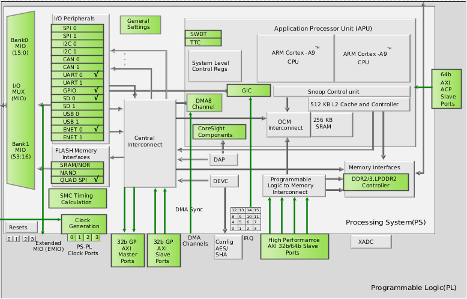
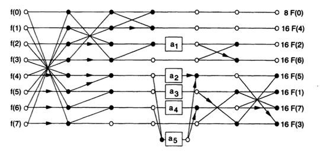

% Projektna dokumentacija za projekt iz predmeta Multimedijske arhitekture i sustavi
% Darko Janeković; Ivan Cindrić; Danijel Belošević; Lovro Knežević; Domagoj Kudek
% 22.01.2020


Opis sustava
============

Sustav je zasnovan na razvojnoj pločici PYNQ-Z1 i kameri ov7670. Na razvojnoj
pločici je ostvaren dohvat slike s kamere, njena obrada i pohrana na SD karticu.
Slika se dohvaća u YUYV formatu gdje je jedan piksel u prosjeku veličine 16
bitova budući da je kromatskih komponenata duplo manje.

Da bi dohvat slike s kamere bio moguć, za početak je potrebno generirati
*bitstream* koji opisuje sklopovlje te na odgovarajuć način povezati isto.

Jednom kad je sklopovlje generirano potrebno je postaviti inicijalizirati
periferne jedinice koje se koriste. Inicijalizacija perifernih jedinica
uključuje i inicijalnu komunikaciju s kamerom i resetiranje njenih registara na
početne vrijednosti. Kamera s procesorskim sustavom komunicira protokolom SSCB
koji je sličan protokolu I2C. Programsko sučelje za komunikaciju implementirano
je pomoću Xilinx programske biblioteke za I2C.

Jednom kad je kamera ispravno konfigurirana, s nje je moguće pročitati podatke.
Jednom kada su podaci pročitani i obrađeni moguće ih je spremiti na SD karticu
tako da ih je moguće prenijeti na drugo računalo. Nakon uspješnog zapisivanja
podataka moguće je istu stvar ponoviti više puta i generirati video ili je pak
moguće završiti s radom.


Blok shema
==========

Blok shema sustava iz programskog alata Vivado prikazana je na slici.


\

Sustav se kao što je to na slici vidljivo sastoji od nekoliko blokova od kojih
su najvažniji blokovi Zynq7, AXI GPIO i AXI I2C.

I AXI GPIO i AXI I2C predstavljaju periferne jedinice.
AXI GPIO se koristi za dohvat podataka s kamere, a AXI I2C za konfiguraciju
kamere preko SSCB protokola.

Zynq7 predstavlja procesorski sustav na kojem se izvršava programski kod i u
nastavku će detaljnije biti opisana točna konfiguracija njegovih perifernih
jedinica.

Od perifernih jedinica koristi se:

* Ethernet: prijenos podataka do korisnika koristeći Ethernet protokol. U
  konačnici slanje podataka preko Etherneta nije ostvareno, ali je on omogućen u
konfiguraciji procesorskog sustava.
* UART: serijska komunikacija za potrebe pronalaženja grešaka.
* SD: pohrana podataka na SD karticu kad Ethernet nije opcija.

Procesorski sustav radi s frekvencijom takta od 650 MHz dok je na priključnicu XCLK
postavljena frekvencija takta 10 MHz. Priključnica XCLK predstavlja signal takta
kamere, a frekvencija je tako postavljena jer je najmanja frekvencija na kojoj
kamera radi 8 MHz.

Potpuna konfiguracija procesorskog sustava prikazana je u nastavku.


\


Korišteni algoritmi
===================

Prije kompresije je potrebno izvesti proširenje podataka iz zapisa 4:2:2 u
zapis 4:4:4. Postupak je moguće izvesti na dva načina:

1. S jednim pomoćnim spremnikom proširujući postojeći spremnik.

2. Alocirajući novi spremnik i nakon što je proširenje obavljeno oslobađajući
memoriju prošlog.

U sustavu koji se opisuje ovim dokumentom implementirana je druga opcija. Prva
opcija je optimalna u prostoru, ali nije optimalna u vremenu i nije moguće
napraviti nekoliko velikih čitanja nego je potrebno raditi puno malih čitanja.
Budući da sustav nije toliko ograničen memorijom, implementirana je druga
opcija koja rezultira s puno manje čitanja i više pogodataka priručne memorije
uz očitu cijenu prostorne složenosti.

Prema broju pozivanja najčešće pozivan algoritam je diskretna kosinusna
transformacija koja radi transformaciju u frekvencijski prostor. JPEG kompresija
je implementirana koristeći programsku biblioteku otvorenog koda TinyJPEG i
modificirajući njene funkcije. Osim obične diskretne kosinusne transformacije
koja radi s kvadratnom složenošću, biblioteka implementira i brzu kosinusnu
transformaciju koja implementira Arai-Agui-Nakajima algoritam za diskretnu
kosinusnu transformaciju. Algoritam je jedan od najbržih i razlika između
naivnog i spomenutog je značajna, a dijagram toka priložen je u nastavku.


\

TinyJPEG inicijalno radi samo s `.bmp` datotekama tako da je bilo potrebno dodati
proširenja koja uključuju čitanje struktura koje sustav koristi. Konkretno,
Jedna od promjena izgleda:

```
    for ( int y = 0; y < height; y += 8 ) {
        for ( int x = 0; x < width; x += 8 ) {
            // Block loop: ====
            for ( int off_y = 0; off_y < 8; ++off_y ) {
                for ( int off_x = 0; off_x < 8; ++off_x ) {
                    int block_index = (off_y * 8 + off_x);
#if YUV444_INPUT
                    int src_index = (y + off_y) * width + (x + off_x);
                    du_y[block_index] = src_data->y[src_index];
                    du_b[block_index] = src_data->u[src_index];
                    du_r[block_index] = src_data->v[src_index];
#else
                    int src_index = ....;
```

gdje je `YUV444_INPUT` preprocesorski macro koji osigurava da se 8x8 blokovi
podataka generiraju imajući na umu da ulazna datoteka više nije `.bmp`.

Nadalje, biblioteka nije napisana za Xilinx sustav i potrebno je osigurati da ne
koristi stvari koje nisu definirane u okviru običnog sustava. U tu svrhu je
korištena *callback* funkcija koja osigurava da će se interni spremnici
biblioteke zapisati na SD karticu na ispravan način.

Pored toga, za JPEG je potrebno implementirati i neku vrstu kodiranja. Ova
biblioteka implementira sekvencijalno Huffmanovo kodiranje pri čemu prilikom
pokretanja generira tablicu kodiranja.

Upute za pokretanje
===================

Budući da sustav ne implementira server, sa sustavom nije moguće upravljati
preko mreže već se program mora ponovno pokretati, a rezultat čitati sa SD
kartice.

Za pokretanje sustava dovoljno je u razvojnom okruženju Vitis preko JTAG
konektora programirati FPGA i pokrenuti program. Prije pokretanja sustava
potrebno je preuzeti datoteke koje parametriziraju sklopovlje (eng. *hardware
specification file*). Datoteku je moguće preuzeti na
[poveznici](https://drive.google.com/open?id=1IEN5dlohzctscwUJXB3D9HVWZ3PvTdHr).
Ukoliko se sustav pokreće koristeći operacijski sustav GNU/Linux, prije
pokretanja je potrebno instalirati odgovarajuće upravljačke programe (eng. *driver*).

Jednom kada je datoteka preuzeta, potrebno ju je učitati u Vitis pri čemu će
alat zatim generirati FSBL (engl. *First Stage Bootloader*) u okviru kojeg će se
nalaziti ranije spomenuti *bitstream* i ostale datoteke potrebne za definiciju
sklopovlja.

U nastavku će detaljnije biti objašnjena struktura direktorija s izvornim
kodovima:

```
$ tree camera/src
camera/src
|-- gpio_helpers.h  # maske za filtriranje GPIO bitova
|-- iic_helpers.c   # implementacija SCCB protokola
|-- iic_helpers.h   # konfiguracijski registri kamere
|-- jpeg.c      # callback pozivi za TinyJPEG
|-- jpeg.h      # modificirani TinyJPEG
|-- lscript.ld
|-- main.c
|-- output.c    # funkcije za pohranu RGB/YUV podataka
|-- output.h
|-- ov7670.c    # inicijalizacija i preuzimanje slike s kamere
|-- ov7670.h
|-- platform.c  # inicijalizacija perifernih jedinica
|-- platform_config.h
|-- platform.h
|-- Xilinx.spec
```

U okviru projekta ostvarena je i Python skripta koja predstavlja TCP
klijenta koji preuzima sliku odmah nakon spajanja na TCP server. Klijent slike
sprema i pokreće grafičko sučelje u kojem je sliku moguće pregledati. Budući da
postavljanje lwIP servera na razvojnoj ploči nije ostvareno, ova komponenta nije
detaljnije objašnjavana iako se nalazi u direktoriju `server/` git repozitorija.
